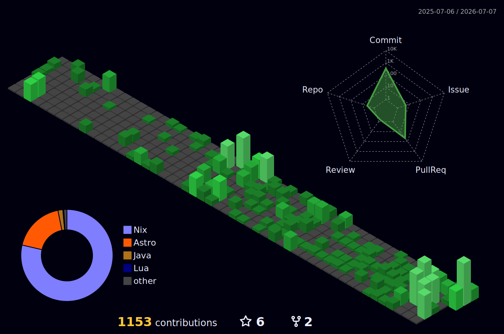

# Poby / Sangmin Kim

Backend-minded DevOps engineer into Nix, reproducible infrastructure, and
Spring-based product backends.

I like building systems that are declared as code, rebuildable from scratch,
automated through CI/CD, and backed by clear backend boundaries.

## Current Focus

- NixOS and nix-darwin as daily operating system and development environment layers
- GitHub Actions based validation, deployment, and operations workflows
- Spring Boot backend systems with Kotlin/Java and relational databases
- Operational docs, runbooks, and repeatable local developer environments

## Pinned Infrastructure

| Project | What it is | Keywords |
| --- | --- | --- |
| [homelab](https://github.com/smg1024/homelab) | NixOS homelab source of truth. Multi-host configuration, service modules, encrypted secrets, documentation, and deployment flow live in one flake. | NixOS, flakes, Caddy, Tailscale, Cloudflare Tunnel, sops-nix, GitHub Actions |
| [nix-darwin](https://github.com/smg1024/nix-darwin) | Declarative macOS setup for my daily machine. Hosts are assembled from small modules with Home Manager and Homebrew managed through Nix. | nix-darwin, Home Manager, nix-homebrew, SOPS, Just, Lua |

## Backend Background

| Project | Domain | Focus |
| --- | --- | --- |
| Spettrum | AI/image product backend | Spring Boot, Gradle, Docker, CI/CD |
| [Teacher for Boss](https://github.com/teacher-for-boss/teacher-for-boss-server) | Mentoring and community app for small business owners | Java, Spring Boot, JPA, MySQL, AWS, GitHub Actions |
| Bang9 | Real estate listing and matching platform for Korean users in the US | Spring backend, API design, database modeling, OpenAPI |
| jamye-plz | "Anything interesting?" product | Product backend, infrastructure, mixed stack, Nix-involved tooling |

## Toolbox

**Infrastructure / DevOps**  
Nix, NixOS, nix-darwin, Home Manager, sops-nix, Docker, GitHub Actions, Caddy,
Tailscale, Cloudflare Tunnel, Just

**Backend**  
Java, Kotlin, Spring Boot, Spring Security, Spring Data JPA, Gradle, PostgreSQL,
MySQL, Redis, OpenAPI, Testcontainers

**Daily Environment**  
Neovim, Lua, macOS, Linux, Shell, Git

## Engineering Taste

- Prefer declarative configuration over manual setup
- Treat server config and developer environments as versioned products
- Make CI/CD the normal path for validation and deployment
- Keep backend APIs explicit, documented, and aligned with domain boundaries

## Elsewhere

- Homelab docs: <https://docs.ridewithmin.com>
- Blog: <https://blog.ridewithmin.com>

## Contribution Graph

  

